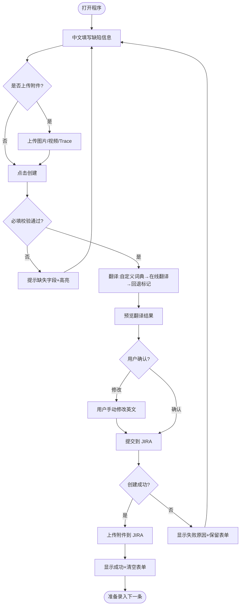
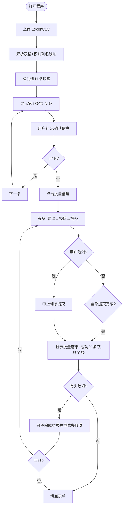

# JIRA 缺陷自动创建工具 - PRD

## 1. 产品概述

### 1.1 背景
测试团队在车载信息娱乐系统测试过程中，需要频繁在 JIRA 上手动创建缺陷 ticket，每次需要填写摘要、优先级、前提条件、步骤、预期结果、实际结果、复现率、recover 步骤等字段，并上传截图/视频和 trace 文件。手动操作重复、耗时、容易遗漏。且 JIRA 上要求用英文填写，测试人员用中文记录后需要额外翻译，进一步增加工作量。

### 1.2 目标
开发一款桌面工具，让测试人员在本地图形界面用中文填写缺陷信息，程序自动翻译为英文后一键创建 JIRA 缺陷；支持通过导入表格批量创建多个缺陷，大幅减少重复操作和翻译负担。

### 1.3 目标用户
- **主要用户**：车载信息娱乐系统测试团队
- **使用场景**：测试执行阶段，发现缺陷后快速录入 JIRA

## 2. 核心功能清单

| # | 功能 | 描述 | 优先级 |
|---|------|------|--------|
| 1 | 缺陷信息填写 | 提供标题、优先级、时间点、前提条件、步骤、预期结果、实际结果、复现率、recover 步骤等输入框 | P0 |
| 2 | 中英文自动翻译 | 提交时自动将标题和描述中所有中文字段翻译为英文，基于自定义词典+在线翻译（百度/有道）+回退标记三层架构 | P0 |
| 3 | 一键创建 JIRA 缺陷 | 点击创建按钮，自动将表单内容翻译并提交到 JIRA，标题映射为摘要，其他字段汇总写入描述 | P0 |
| 4 | 必填校验 | 创建前检查所有文本输入框是否已填写（trace/图片/表格除外），未填写时提示具体缺失项 | P0 |
| 5 | 自动清空 | JIRA 缺陷创建成功后，自动清空所有输入框，准备下一条 | P0 |
| 6 | 附件上传-图片/视频 | 上传图片或视频文件，创建缺陷时自动附加到 JIRA ticket | P0 |
| 7 | 附件上传-Trace | 上传 trace 文件，创建缺陷时自动附加到 JIRA ticket | P0 |
| 8 | 表格导入 | 导入 Excel(.xlsx) 或 CSV 文件，解析其中的缺陷数据，自动填写到各输入框 | P0 |
| 9 | 批量创建引导 | 表格中有多条缺陷时，逐条引导用户补充/确认信息，全部完成后一键批量创建，支持取消和部分重试 | P0 |
| 10 | JIRA 配置管理 | 内置配置页面，保存 JIRA 服务器地址、用户名、API Token 等连接信息 | P0 |
| 11 | 创建结果反馈 | 显示每条缺陷的创建结果（成功/失败），失败时给出原因 | P1 |
| 12 | JIRA 项目/Issue Type 选择 | 配置默认项目 Key 和 Issue Type，避免每次手动选择 | P1 |
| 13 | 翻译词典管理 | 允许用户维护和导入自定义术语词典，提升翻译准确性 | P1 |
| 14 | 草稿保存 | 未提交的缺陷信息自动保存为草稿，下次打开可恢复 | P1 |
| 15 | 在线翻译配置 | 支持配置百度翻译或有道智云 API，开启后未匹配词典的文本自动调用在线翻译 | P1 |
| 16 | 缺陷模板 | 预设常用缺陷模板（如 crash、功能异常、性能问题），快速填充字段 | P2 |

## 3. 用户故事

**测试人员角色：**

- 作为测试人员，我想要在桌面应用中用中文填写缺陷信息，程序自动翻译为英文后创建 JIRA 缺陷，以便减少手动翻译和重复输入的时间
- 作为测试人员，我想要填写缺陷发生的时间点信息，以便在 JIRA 缺陷描述中记录问题出现的时间
- 作为测试人员，我想要上传截图/视频和 trace 文件作为附件，以便在 JIRA 缺陷中附带完整的证据材料
- 作为测试人员，我想要导入 Excel/CSV 表格批量创建缺陷，以便一次性将整个测试轮次的缺陷录入 JIRA
- 作为测试人员，我想要程序校验必填字段并提示缺失项，以便避免提交不完整的缺陷信息
- 作为测试人员，我想要 JIRA 缺陷创建成功后自动清空表单，以便快速开始录入下一条缺陷
- 作为测试人员，我想要维护自定义术语词典，以便常用专业术语（如"HMI""Navi""carplay"）翻译准确
- 作为测试人员，我想要启用在线翻译（百度或有道），以便自定义词典未覆盖的中文也能自动翻译为英文，而不是显示为未翻译标记

**团队管理员角色：**

- 作为团队管理员，我想要在程序内配置和管理 JIRA 连接信息，以便团队成员无需手动配置 API Token 等敏感信息
- 作为团队管理员，我想要配置在线翻译服务的 API 凭证，以便团队成员可以使用在线翻译功能

## 4. 功能详细描述与验收标准

### F1 - 缺陷信息填写

**描述**：主界面提供以下输入区域：
- 标题（单行输入框）
- 优先级（下拉选择：Blocker / Critical / Major / Minor / Trivial，支持从 JIRA 动态获取优先级列表）
- 时间点（单行输入框）
- 前提条件（多行文本框）
- 步骤（多行文本框）
- 预期结果（多行文本框）
- 实际结果（多行文本框）
- 复现率（下拉选择：Always / Often / Sometimes / Rarely / Unable to Reproduce）
- Recover 步骤（多行文本框）
- 图片/视频上传区域（支持拖拽和点击上传，支持 png/jpg/mp4/mov）
- Trace 上传区域（支持 .txt/.log/.zip）
- 表格上传区域（支持 .xlsx/.csv）

**验收标准**：
- [ ] 所有文本输入框可正常输入中文内容
- [ ] 优先级和复现率为下拉选择，不可自定义输入
- [ ] 优先级列表支持从 JIRA 动态获取，获取失败时使用默认值
- [ ] 附件区域支持拖拽上传和点击选择文件
- [ ] 表格上传后自动解析并填充表单

### F2 - 中英文自动翻译

**描述**：用户点击创建后，程序自动将标题及描述中各字段的中文内容翻译为英文。翻译采用三层架构：自定义词典→在线翻译→回退标记。离线状态下翻译功能仍可工作（在线翻译不可用时自动降级）。翻译完成后，标题对应 JIRA 的 Summary 字段（英文），描述中各副标题和内容均为英文。

**翻译规则**：
1. 第一层：优先匹配用户自定义术语词典中的条目（最长匹配优先）
2. 第二层：未匹配的中文文本，若在线翻译已启用且可用，调用在线翻译 API（百度翻译或有道智云）翻译
3. 第三层：在线翻译不可用或未启用时，仍未翻译的中文文本标记为 `[未翻译: {原文}]`
4. 翻译结果可预览，用户可在预览中手动修改后再提交
5. 副标题（如"Timestamp""Precondition""Steps""Expected Result"等）为固定英文，不翻译

**在线翻译支持**：
- 百度翻译 API：使用 App ID + Secret + MD5 签名认证
- 有道智云 API：使用 App Key + App Secret + SHA256 签名认证
- 用户可在设置页面选择翻译服务提供商和配置 API 凭证
- 在线翻译为可选功能，关闭后仅使用自定义词典+回退标记

**JIRA 描述格式**：
```
h2. Timestamp
{翻译后的时间点}

h2. Precondition
{翻译后的前提条件}

h2. Steps
{翻译后的步骤}

h2. Expected Result
{翻译后的预期结果}

h2. Actual Result
{翻译后的实际结果}

h2. Reproduce Rate
{翻译后的复现率}

h2. Recover Steps
{翻译后的 recover 步骤}
```

**验收标准**：
- [ ] 标题中文输入自动翻译为英文后填入 JIRA Summary
- [ ] 描述中各字段副标题为固定英文
- [ ] 描述中各字段内容从中文翻译为英文
- [ ] 翻译前可预览英文结果，用户可手动修改
- [ ] 自定义术语词典中的术语优先翻译、不被在线翻译引擎覆盖
- [ ] 在线翻译启用时，词典未覆盖的中文自动调用在线 API 翻译
- [ ] 在线翻译未启用或不可用时，未翻译的中文标记为 `[未翻译: {原文}]`
- [ ] 离线状态下翻译功能正常工作（降级为词典+回退标记）

### F3 - 一键创建 JIRA 缺陷

**描述**：用户点击"创建"按钮后，程序执行：1) 必填校验 → 2) 翻译为英文（自定义词典→在线翻译→回退标记） → 3) 预览确认 → 4) 调用 JIRA REST API 创建缺陷 → 5) 上传附件 → 6) 清空表单。

**验收标准**：
- [ ] 调用 JIRA REST API 成功创建 Issue，项目 Key 和 Issue Type 从配置中读取
- [ ] 标题映射到 JIRA Summary 字段
- [ ] 其他字段按 F2 描述的格式写入 JIRA Description 字段
- [ ] 优先级映射到 JIRA Priority 字段（使用 JIRA 优先级 ID，支持数字 ID 或名称自动解析）
- [ ] 创建成功后自动上传图片/视频和 trace 到该 Issue 的附件
- [ ] 创建成功后自动清空所有输入框和上传区域
- [ ] 创建失败时保留表单内容，显示错误信息（如网络错误、权限不足等）

### F4 - 必填校验

**描述**：点击创建时，程序检查所有文本输入框是否已填写。Trace、图片/视频、表格上传区域为非必填。

**验收标准**：
- [ ] 标题、优先级、时间点、前提条件、步骤、预期结果、实际结果、复现率、recover 步骤任一为空时，阻止创建
- [ ] 提示信息明确指出哪个字段未填写
- [ ] 未填写的输入框高亮显示

### F5 - 表格导入

**描述**：用户上传 Excel(.xlsx) 或 CSV 文件，程序解析表格中的缺陷数据，识别列名与程序字段的映射关系，自动填充到各输入框。如果表格中没有所映射的列名，所对应的程序输入框留空。

**表格列名映射规则**：
- 标题 / Title / Summary → 标题输入框
- 优先级 / Priority → 优先级下拉框
- 时间点 / Timestamp → 时间点输入框
- 前提条件 / Precondition → 前提条件输入框
- 步骤 / Steps → 步骤输入框
- 预期结果 / Expected Result → 预期结果输入框
- 实际结果 / Actual Result → 实际结果输入框
- 复现率 / Reproduce Rate → 复现率下拉框
- Recover步骤 / Recover Steps → Recover步骤输入框

**中文值自动映射**：
- 优先级：阻塞→Blocker，严重→Critical，重要→Major，一般→Minor，轻微→Trivial
- 复现率：总是→Always，经常→Often，有时→Sometimes，很少→Rarely，无法复现→Unable to Reproduce

**验收标准**：
- [ ] 支持 .xlsx 和 .csv 格式
- [ ] 自动识别中英文列名并映射到对应字段
- [ ] 无法映射的列名给出提示
- [ ] 表格中有多行数据时，进入批量创建引导模式

### F6 - 批量创建引导

**描述**：表格中有多条缺陷时，程序逐条展示给用户，用户可以补充或修改信息。所有条目确认完毕后，点击"批量创建"，程序逐条调用 JIRA API 创建。

**界面交互**：
- 显示当前第 N 条 / 共 M 条的进度指示
- 提供"上一条""下一条"切换按钮
- 每条缺陷可单独编辑
- 全部确认后点击"批量创建"，程序逐条提交
- 批量提交过程中可点击"取消"中止剩余条目的提交
- 部分成功部分失败时，可点击"移除成功项并重试"仅重新提交失败的条目

**验收标准**：
- [ ] 表格导入后显示总条数和当前进度
- [ ] 可前后切换查看/编辑每条缺陷
- [ ] 批量创建时逐条提交，显示每条的结果
- [ ] 批量提交过程中可取消，中止剩余条目的提交
- [ ] 部分成功部分失败时，显示每条的具体结果，可移除成功项并重试失败项
- [ ] 批量创建完成后清空所有内容

### F7 - JIRA 配置管理

**描述**：程序内置配置页面，用于管理 JIRA 连接信息。

**配置项**：
- JIRA 服务器地址（如 https://yourcompany.atlassian.net）
- 用户名（邮箱）
- API Token
- 默认项目 Key
- 默认 Issue Type
- 连接测试按钮

**验收标准**：
- [ ] 配置信息保存到本地，下次打开自动加载
- [ ] API Token 使用 AES-256-GCM 加密存储，界面显示为遮罩
- [ ] 提供连接测试按钮，验证配置是否正确
- [ ] 配置修改后实时生效，无需重启程序

### F8 - 翻译词典管理

**描述**：允许用户维护自定义术语词典，提升专业术语翻译准确性。

**功能**：
- 添加/编辑/删除术语条目（中文 → 英文映射）
- 支持导入/导出词典文件（.json 或 .csv）
- 词典优先级高于通用翻译引擎

**验收标准**：
- [ ] 可在设置页面添加、编辑、删除术语映射
- [ ] 支持导入外部词典文件
- [ ] 翻译时自定义术语优先匹配
- [ ] 词典保存后立即生效

### F9 - 在线翻译配置

**描述**：用户可在设置页面配置在线翻译服务，启用后将自定义词典未覆盖的中文文本自动调用在线 API 翻译，减少 `[未翻译: ...]` 标记的出现。

**配置项**：
- 在线翻译开关（启用/禁用）
- 翻译服务提供商选择（百度翻译 / 有道智云）
- 百度翻译：App ID + Secret
- 有道智云：App Key + App Secret
- API 凭证加密存储

**验收标准**：
- [ ] 可在设置页面启用/禁用在线翻译
- [ ] 可选择翻译服务提供商（百度或有道）
- [ ] 可配置对应服务的 API 凭证
- [ ] API 凭证加密存储，界面显示为遮罩
- [ ] 在线翻译启用且凭证正确时，词典未覆盖的中文自动翻译
- [ ] 在线翻译不可用时自动降级为词典+回退标记模式

## 5. 核心业务流程图

### 5.1 单条缺陷创建流程



### 5.2 表格批量导入流程



## 6. 非功能需求

| 类别 | 要求 |
|------|------|
| **平台兼容** | 支持 Windows 10+ 和 macOS 12+ |
| **技术栈** | Tauri + React + TypeScript + Ant Design（轻量、跨平台、体积小） |
| **性能** | 单条缺陷创建（含附件上传）≤ 10 秒；表格解析 ≤ 3 秒（100 行以内）；本地翻译单条 ≤ 1 秒 |
| **安全** | JIRA API Token 和在线翻译 API 凭证使用 AES-256-GCM 加密存储，不明文保存在配置文件中 |
| **网络** | 需要访问 JIRA 服务器网络；在线翻译需网络连接；离线时翻译降级为词典+回退标记；断网时给出明确提示 |
| **兼容性** | 支持 JIRA Cloud 和 JIRA Data Center (On-Premise) REST API v2 |
| **文件格式** | 表格：.xlsx / .csv；图片：png / jpg；视频：mp4 / mov；trace：.txt / .log / .zip |
| **翻译** | 三层翻译架构：自定义词典→在线翻译（百度/有道）→回退标记；离线可用（降级模式）；支持自定义术语词典 |
| **可用性** | 表单操作无需文档即可上手；批量导入流程有进度和引导提示；草稿自动保存 |

## 7. 技术方案建议

### 7.1 推荐技术栈：Tauri + React + TypeScript + Ant Design

**理由**：
- Tauri 体积小（安装包 ~10MB vs Electron ~150MB），性能好，适合工具类应用
- React + TypeScript 提供类型安全的组件化开发，Ant Design 组件丰富
- Rust 后端保证安全性和性能，JIRA API 调用和加密操作在 Rust 层完成

### 7.2 三层翻译架构

采用三层翻译架构：
1. **自定义术语层**：用户维护的中文→英文映射词典，最长匹配优先算法替换
2. **在线翻译层**：可选启用，调用百度翻译或有道智云 API 翻译词典未覆盖的文本
   - 百度翻译：App ID + Secret + MD5 签名认证
   - 有道智云：App Key + App Secret + SHA256 签名认证
   - 在线翻译失败后 30 秒冷却期，避免频繁重试
3. **回退标记层**：在线翻译不可用或未启用时，未翻译的中文文本标记为 `[未翻译: {原文}]`

### 7.3 JIRA API 对接

- 使用 JIRA REST API v2
- 认证方式：HTTP Basic Auth（用户名 + API Token）
- 测试连接：`GET /rest/api/2/myself`
- 获取优先级列表：`GET /rest/api/2/priority`
- 创建缺陷：`POST /rest/api/2/issue`
- 上传附件：`POST /rest/api/2/issue/{issueKey}/attachments`（需 `X-Atlassian-Token: no-check` 头）

### 7.4 安全方案

- JIRA API Token 和在线翻译 API 凭证使用 AES-256-GCM 加密存储
- Rust 后端提供 `encrypt_value` / `decrypt_value` 命令
- 加密过程：随机生成 12 字节 IV → AES-256-GCM 加密 → 拼接 IV + 密文 + 认证标签 → Base64 编码
- UI 层 API Token 和凭证输入框以遮罩方式显示

## 8. 验证方案

1. **单条创建**：填写所有字段（含时间点） → 点击创建 → 确认 JIRA 上缺陷已创建且英文翻译正确 → 附件已上传 → 表单自动清空
2. **必填校验**：留空某个字段（含时间点） → 点击创建 → 确认提示缺失字段并高亮
3. **表格导入**：上传含 3 条缺陷的 Excel → 确认逐条填充正确（含时间点字段） → 批量创建 → 确认 3 条缺陷均创建成功
4. **翻译验证**：输入中文专业术语 → 确认自定义词典优先翻译 → 输入词典未覆盖的中文 → 确认在线翻译结果（启用时）/ 确认显示 `[未翻译: ...]`（未启用时） → 手动修改翻译 → 确认修改后内容提交到 JIRA
5. **在线翻译验证**：配置百度/有道翻译凭证 → 启用在线翻译 → 输入词典未覆盖的中文 → 确认在线翻译功能正常 → 关闭在线翻译 → 确认降级为词典+回退标记
6. **批量取消与重试**：上传含 5 条缺陷的表格 → 批量创建 → 中途取消 → 确认已提交的正常处理 → 部分失败后点击重试 → 确认仅重试失败项
7. **配置管理**：设置 JIRA 连接信息 → 测试连接 → 确认保存和加载正常 → 确认 API Token 加密存储
8. **草稿保存**：填写部分字段后关闭程序 → 重新打开 → 确认内容已自动恢复
9. **跨平台**：在 Windows 和 macOS 上分别验证上述所有功能
