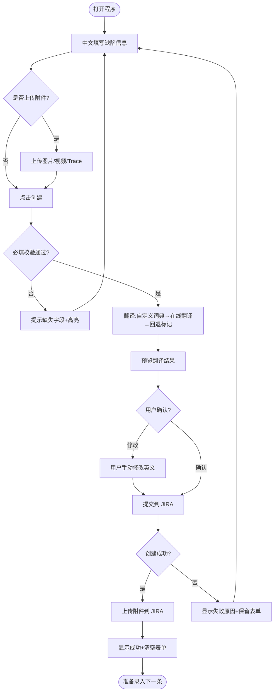
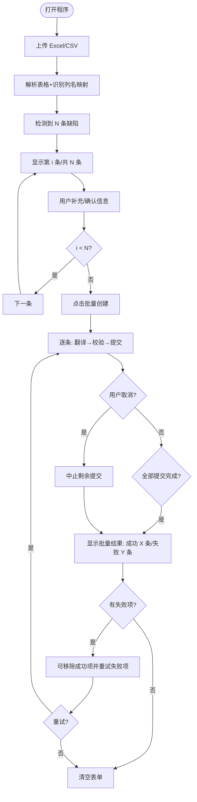
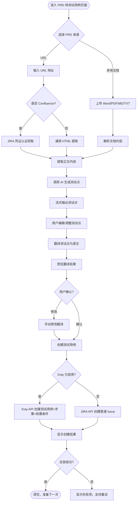
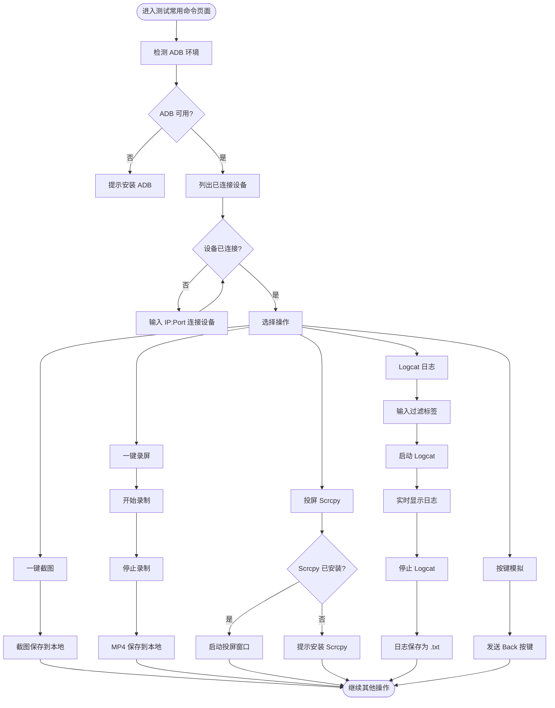

# JIRA 测试工具 - PRD

## 1. 产品概述

### 1.1 背景
测试团队在车载信息娱乐系统测试过程中，需要频繁在 JIRA 上手动创建缺陷 ticket，每次需要填写摘要、优先级、前提条件、步骤、预期结果、实际结果、复现率、recover 步骤等字段，并上传截图/视频和 trace 文件。手动操作重复、耗时、容易遗漏。且 JIRA 上要求用英文填写，测试人员用中文记录后需要额外翻译，进一步增加工作量。

此外，测试团队在需求分析阶段需要根据 PRD 文档手动编写测试用例，工作量大且容易遗漏测试点；编写后的测试用例还需手动创建到 JIRA/Xray 中，效率低下。

### 1.2 目标
开发一款桌面工具，核心目标有二：
1. **缺陷录入**：让测试人员在本地图形界面用中文填写缺陷信息，程序自动翻译为英文后一键创建 JIRA 缺陷；支持通过导入表格批量创建多个缺陷，大幅减少重复操作和翻译负担。
2. **PRD 转测试用例**：上传 PRD 文档或输入 URL，利用 AI 自动生成测试点，翻译为英文后一键创建 JIRA/Xray 测试用例，减少从需求到测试用例的人力投入。

### 1.3 目标用户
- **主要用户**：车载信息娱乐系统测试团队
- **使用场景**：
  - 需求分析阶段：根据 PRD 文档生成测试用例
  - 测试执行阶段：发现缺陷后快速录入 JIRA

## 2. 核心功能清单

| # | 功能 | 描述 | 优先级 |
|---|------|------|--------|
| 1 | 缺陷信息填写 | 提供标题、优先级、时间点、前提条件、步骤、预期结果、实际结果、复现率、recover 步骤等输入框 | P0 |
| 2 | 中英文自动翻译 | 提交时自动将标题和描述中所有中文字段翻译为英文，基于自定义词典+在线翻译（百度/有道）+回退标记三层架构 | P0 |
| 3 | 一键创建 JIRA 缺陷 | 点击创建按钮，自动将表单内容翻译并提交到 JIRA，标题映射为摘要，其他字段汇总写入描述 | P0 |
| 4 | 必填校验 | 创建前检查所有文本输入框是否已填写（trace/图片/表格除外），未填写时提示具体缺失项 | P0 |
| 5 | 自动清空 | JIRA 缺陷创建成功后，自动清空所有输入框，准备下一条 | P0 |
| 6 | 附件上传-图片/视频 | 上传图片或视频文件，创建缺陷时自动附加到 JIRA ticket | P0 |
| 7 | 附件上传-Trace | 上传 trace 文件，创建缺陷时自动附加到 JIRA ticket | P0 |
| 8 | 表格导入 | 导入 Excel(.xlsx) 或 CSV 文件，解析其中的缺陷数据，自动填写到各输入框 | P0 |
| 9 | 批量创建引导 | 表格中有多条缺陷时，逐条引导用户补充/确认信息，全部完成后一键批量创建，支持取消和部分重试 | P0 |
| 10 | JIRA 配置管理 | 内置配置页面，保存 JIRA 服务器地址、用户名、API Token 等连接信息 | P0 |
| 11 | 创建结果反馈 | 显示每条缺陷的创建结果（成功/失败），失败时给出原因 | P1 |
| 12 | JIRA 项目/Issue Type 选择 | 配置默认项目 Key 和 Issue Type，避免每次手动选择 | P1 |
| 13 | 翻译词典管理 | 允许用户维护和导入自定义术语词典，提升翻译准确性 | P1 |
| 14 | 草稿保存 | 未提交的缺陷信息自动保存为草稿，下次打开可恢复 | P1 |
| 15 | 在线翻译配置 | 支持配置百度翻译或有道智云 API，开启后未匹配词典的文本自动调用在线翻译 | P1 |
| 16 | 缺陷模板 | 预设常用缺陷模板（如 crash、功能异常、性能问题），快速填充字段 | P2 |
| 17 | PRD 转测试用例 | 上传 PRD 文档或输入 URL，AI 自动生成测试点，翻译后创建 JIRA/Xray 测试用例 | P0 |
| 18 | AI 集成 | 支持多种 AI 模型（Claude/OpenAI/DeepSeek），可自定义 API 地址，用于生成测试点 | P0 |
| 19 | Xray 测试用例创建 | 通过 Xray Cloud API 创建带测试步骤和前置条件的结构化测试用例 | P0 |
| 20 | PRD 文档解析 | 支持 Word(.docx)/PDF/Markdown/文本文件解析，提取 PRD 内容供 AI 分析 | P0 |
| 21 | URL/Confluence 内容抓取 | 输入 URL 自动抓取页面内容，支持 Confluence 页面认证抓取 | P0 |
| 22 | 测试用例 JIRA 独立配置 | 测试用例使用独立的 JIRA 项目/Issue Type 配置，与缺陷配置分离 | P1 |
| 23 | ADB 命令集成 | 集成 Android Debug Bridge，提供设备连接管理、截图、录屏、投屏、Logcat 日志抓取、按键模拟等常用测试命令 | P0 |
| 24 | 缺陷模板管理 | 预设和自定义缺陷模板，快速填充常用字段组合，支持新建/编辑/删除/应用模板 | P1 |

## 3. 用户故事

**测试人员角色：**

- 作为测试人员，我想要在桌面应用中用中文填写缺陷信息，程序自动翻译为英文后创建 JIRA 缺陷，以便减少手动翻译和重复输入的时间
- 作为测试人员，我想要填写缺陷发生的时间点信息，以便在 JIRA 缺陷描述中记录问题出现的时间
- 作为测试人员，我想要上传截图/视频和 trace 文件作为附件，以便在 JIRA 缺陷中附带完整的证据材料
- 作为测试人员，我想要导入 Excel/CSV 表格批量创建缺陷，以便一次性将整个测试轮次的缺陷录入 JIRA
- 作为测试人员，我想要程序校验必填字段并提示缺失项，以便避免提交不完整的缺陷信息
- 作为测试人员，我想要 JIRA 缺陷创建成功后自动清空表单，以便快速开始录入下一条缺陷
- 作为测试人员，我想要维护自定义术语词典，以便常用专业术语（如"HMI""Navi""carplay"）翻译准确
- 作为测试人员，我想要启用在线翻译（百度或有道），以便自定义词典未覆盖的中文也能自动翻译为英文，而不是显示为未翻译标记

**团队管理员角色：**

- 作为团队管理员，我想要在程序内配置和管理 JIRA 连接信息，以便团队成员无需手动配置 API Token 等敏感信息
- 作为团队管理员，我想要配置在线翻译服务的 API 凭证，以便团队成员可以使用在线翻译功能

**测试人员-PRD转测试用例角色：**

- 作为测试人员，我想要上传 PRD 文档或输入 URL，让 AI 自动分析并生成测试点，以便快速覆盖需求中的测试场景
- 作为测试人员，我想要对 AI 生成的测试点进行编辑和调整，以便确保测试点的准确性和完整性
- 作为测试人员，我想要将测试点翻译为英文后一键创建到 JIRA/Xray，以便自动生成结构化的测试用例（含测试步骤和前置条件）
- 作为测试人员，我想要使用自定义 AI 模型和 API 地址，以便适应团队已有的 AI 服务配置

**团队管理员-AI与Xray配置角色：**

- 作为团队管理员，我想要配置 AI 服务（Claude/OpenAI/DeepSeek）的 API 凭证，以便团队成员可以使用 AI 生成测试点
- 作为团队管理员，我想要配置 Xray Cloud 的 Client ID/Secret，以便测试用例可以自动创建到 Xray 中

**测试人员-ADB 命令角色：**

- 作为测试人员，我想要在工具内直接执行 ADB 命令（截图、录屏、抓日志），以便在发现缺陷时快速收集证据材料
- 作为测试人员，我想要通过工具连接和管理 ADB 设备，以便减少在终端和工具之间切换的操作
- 作为测试人员，我想要一键启动 scrcpy 投屏，以便在电脑上实时操控和观察车载设备界面
- 作为测试人员，我想要实时查看 Logcat 日志并支持过滤，以便快速定位问题原因

**测试人员-缺陷模板角色：**

- 作为测试人员，我想要将常用的缺陷字段组合保存为模板，以便录入同类缺陷时快速填充，减少重复输入
- 作为测试人员，我想要管理（新建/编辑/删除）缺陷模板，以便根据不同测试场景维护多套预设

## 4. 功能详细描述与验收标准

### F1 - 缺陷信息填写

**描述**：主界面提供以下输入区域：
- 标题（单行输入框）
- 优先级（下拉选择：Blocker / Critical / Major / Minor / Trivial，支持从 JIRA 动态获取优先级列表）
- 时间点（单行输入框）
- 前提条件（多行文本框）
- 步骤（多行文本框）
- 预期结果（多行文本框）
- 实际结果（多行文本框）
- 复现率（下拉选择：Always / Often / Sometimes / Rarely / Unable to Reproduce）
- Recover 步骤（多行文本框）
- 图片/视频上传区域（支持拖拽和点击上传，支持 png/jpg/mp4/mov）
- Trace 上传区域（支持 .txt/.log/.zip）
- 表格上传区域（支持 .xlsx/.csv）

**验收标准**：
- [ ] 所有文本输入框可正常输入中文内容
- [ ] 优先级和复现率为下拉选择，不可自定义输入
- [ ] 优先级列表支持从 JIRA 动态获取，获取失败时使用默认值
- [ ] 附件区域支持拖拽上传和点击选择文件
- [ ] 表格上传后自动解析并填充表单

### F2 - 中英文自动翻译

**描述**：用户点击创建后，程序自动将标题及描述中各字段的中文内容翻译为英文。翻译采用三层架构：自定义词典→在线翻译→回退标记。离线状态下翻译功能仍可工作（在线翻译不可用时自动降级）。翻译完成后，标题对应 JIRA 的 Summary 字段（英文），描述中各副标题和内容均为英文。

**翻译规则**：
1. 第一层：优先匹配用户自定义术语词典中的条目（最长匹配优先）
2. 第二层：未匹配的中文文本，若在线翻译已启用且可用，调用在线翻译 API（百度翻译或有道智云）翻译
3. 第三层：在线翻译不可用或未启用时，仍未翻译的中文文本标记为 `[未翻译: {原文}]`
4. 翻译结果可预览，用户可在预览中手动修改后再提交
5. 副标题（如"Timestamp""Precondition""Steps""Expected Result"等）为固定英文，不翻译

**在线翻译支持**：
- 百度翻译 API：使用 App ID + Secret + MD5 签名认证
- 有道智云 API：使用 App Key + App Secret + SHA256 签名认证
- 用户可在设置页面选择翻译服务提供商和配置 API 凭证
- 在线翻译为可选功能，关闭后仅使用自定义词典+回退标记

**JIRA 描述格式**：
```
h2. Timestamp
{翻译后的时间点}

h2. Precondition
{翻译后的前提条件}

h2. Steps
{翻译后的步骤}

h2. Expected Result
{翻译后的预期结果}

h2. Actual Result
{翻译后的实际结果}

h2. Reproduce Rate
{翻译后的复现率}

h2. Recover Steps
{翻译后的 recover 步骤}
```

**验收标准**：
- [ ] 标题中文输入自动翻译为英文后填入 JIRA Summary
- [ ] 描述中各字段副标题为固定英文
- [ ] 描述中各字段内容从中文翻译为英文
- [ ] 翻译前可预览英文结果，用户可手动修改
- [ ] 自定义术语词典中的术语优先翻译、不被在线翻译引擎覆盖
- [ ] 在线翻译启用时，词典未覆盖的中文自动调用在线 API 翻译
- [ ] 在线翻译未启用或不可用时，未翻译的中文标记为 `[未翻译: {原文}]`
- [ ] 离线状态下翻译功能正常工作（降级为词典+回退标记）

### F3 - 一键创建 JIRA 缺陷

**描述**：用户点击"创建"按钮后，程序执行：1) 必填校验 → 2) 翻译为英文（自定义词典→在线翻译→回退标记） → 3) 预览确认 → 4) 调用 JIRA REST API 创建缺陷 → 5) 上传附件 → 6) 清空表单。

**验收标准**：
- [ ] 调用 JIRA REST API 成功创建 Issue，项目 Key 和 Issue Type 从配置中读取
- [ ] 标题映射到 JIRA Summary 字段
- [ ] 其他字段按 F2 描述的格式写入 JIRA Description 字段
- [ ] 优先级映射到 JIRA Priority 字段（使用 JIRA 优先级 ID，支持数字 ID 或名称自动解析）
- [ ] 创建成功后自动上传图片/视频和 trace 到该 Issue 的附件
- [ ] 创建成功后自动清空所有输入框和上传区域
- [ ] 创建失败时保留表单内容，显示错误信息（如网络错误、权限不足等）

### F4 - 必填校验

**描述**：点击创建时，程序检查所有文本输入框是否已填写。Trace、图片/视频、表格上传区域为非必填。

**验收标准**：
- [ ] 标题、优先级、时间点、前提条件、步骤、预期结果、实际结果、复现率、recover 步骤任一为空时，阻止创建
- [ ] 提示信息明确指出哪个字段未填写
- [ ] 未填写的输入框高亮显示

### F5 - 表格导入

**描述**：用户上传 Excel(.xlsx) 或 CSV 文件，程序解析表格中的缺陷数据，识别列名与程序字段的映射关系，自动填充到各输入框。如果表格中没有所映射的列名，所对应的程序输入框留空。

**表格列名映射规则**：
- 标题 / Title / Summary → 标题输入框
- 优先级 / Priority → 优先级下拉框
- 时间点 / Timestamp → 时间点输入框
- 前提条件 / Precondition → 前提条件输入框
- 步骤 / Steps → 步骤输入框
- 预期结果 / Expected Result → 预期结果输入框
- 实际结果 / Actual Result → 实际结果输入框
- 复现率 / Reproduce Rate → 复现率下拉框
- Recover步骤 / Recover Steps → Recover步骤输入框

**中文值自动映射**：
- 优先级：阻塞→Blocker，严重→Critical，重要→Major，一般→Minor，轻微→Trivial
- 复现率：总是→Always，经常→Often，有时→Sometimes，很少→Rarely，无法复现→Unable to Reproduce

**验收标准**：
- [ ] 支持 .xlsx 和 .csv 格式
- [ ] 自动识别中英文列名并映射到对应字段
- [ ] 无法映射的列名给出提示
- [ ] 表格中有多行数据时，进入批量创建引导模式

### F6 - 批量创建引导

**描述**：表格中有多条缺陷时，程序逐条展示给用户，用户可以补充或修改信息。所有条目确认完毕后，点击"批量创建"，程序逐条调用 JIRA API 创建。

**界面交互**：
- 显示当前第 N 条 / 共 M 条的进度指示
- 提供"上一条""下一条"切换按钮
- 每条缺陷可单独编辑
- 全部确认后点击"批量创建"，程序逐条提交
- 批量提交过程中可点击"取消"中止剩余条目的提交
- 部分成功部分失败时，可点击"移除成功项并重试"仅重新提交失败的条目

**验收标准**：
- [ ] 表格导入后显示总条数和当前进度
- [ ] 可前后切换查看/编辑每条缺陷
- [ ] 批量创建时逐条提交，显示每条的结果
- [ ] 批量提交过程中可取消，中止剩余条目的提交
- [ ] 部分成功部分失败时，显示每条的具体结果，可移除成功项并重试失败项
- [ ] 批量创建完成后清空所有内容

### F7 - JIRA 配置管理

**描述**：程序内置配置页面，用于管理 JIRA 连接信息。

**配置项**：
- JIRA 服务器地址（如 https://yourcompany.atlassian.net）
- 用户名（邮箱）
- API Token
- 默认项目 Key
- 默认 Issue Type
- 连接测试按钮

**验收标准**：
- [ ] 配置信息保存到本地，下次打开自动加载
- [ ] API Token 使用 AES-256-GCM 加密存储，界面显示为遮罩
- [ ] 提供连接测试按钮，验证配置是否正确
- [ ] 配置修改后实时生效，无需重启程序

### F8 - 翻译词典管理

**描述**：允许用户维护自定义术语词典，提升专业术语翻译准确性。

**功能**：
- 添加/编辑/删除术语条目（中文 → 英文映射）
- 支持导入/导出词典文件（.json 或 .csv）
- 词典优先级高于通用翻译引擎

**验收标准**：
- [ ] 可在设置页面添加、编辑、删除术语映射
- [ ] 支持导入外部词典文件
- [ ] 翻译时自定义术语优先匹配
- [ ] 词典保存后立即生效

### F9 - 在线翻译配置

**描述**：用户可在设置页面配置在线翻译服务，启用后将自定义词典未覆盖的中文文本自动调用在线 API 翻译，减少 `[未翻译: ...]` 标记的出现。

**配置项**：
- 在线翻译开关（启用/禁用）
- 翻译服务提供商选择（百度翻译 / 有道智云）
- 百度翻译：App ID + Secret
- 有道智云：App Key + App Secret
- API 凭证加密存储

**验收标准**：
- [ ] 可在设置页面启用/禁用在线翻译
- [ ] 可选择翻译服务提供商（百度或有道）
- [ ] 可配置对应服务的 API 凭证
- [ ] API 凭证加密存储，界面显示为遮罩
- [ ] 在线翻译启用且凭证正确时，词典未覆盖的中文自动翻译
- [ ] 在线翻译不可用时自动降级为词典+回退标记模式

### F10 - PRD 转测试用例

**描述**：用户上传 PRD 文档或输入 URL，程序提取内容后调用 AI 生成测试点，用户可编辑/调整测试点，翻译为英文后一键创建 JIRA/Xray 测试用例。整个流程通过 4 步向导引导完成。

**4 步向导工作流**：
1. **Step 0 - 上传 PRD**：支持两种输入方式——本地上传文档或输入 URL 地址
2. **Step 1 - AI 生成测试点**：调用 AI 服务分析 PRD 内容，生成结构化测试点（含标题、描述、前置条件、测试步骤、优先级），支持流式输出实时查看生成过程
3. **Step 2 - 翻译测试用例**：将中文测试点翻译为英文，使用现有的三层翻译架构（自定义词典→在线翻译→回退标记）
4. **Step 3 - 创建测试用例**：将翻译后的测试点创建到 JIRA，若启用 Xray 则创建为 Xray 测试用例（含测试步骤和前置条件）

**测试点数据结构**：
- 标题（title）
- 描述（description）
- 前置条件（precondition）
- 测试步骤（steps）：每步包含操作（action）和预期结果（expectedResult）
- 优先级（priority）

**验收标准**：
- [ ] 支持上传本地文档（.docx/.pdf/.md/.txt）和输入 URL
- [ ] AI 生成测试点时支持流式输出，实时显示生成内容
- [ ] 用户可对 AI 生成的测试点进行增删改操作
- [ ] 测试点可翻译为英文后再创建到 JIRA
- [ ] 支持批量创建多条测试用例
- [ ] 创建结果逐条反馈（成功/失败）
- [ ] 向导步骤可自由切换（已到达的步骤内）

### F11 - AI 集成

**描述**：集成多种 AI 模型服务，用于根据 PRD 内容生成测试点。支持 Claude、OpenAI、DeepSeek 三种提供商，并可自定义 API 地址接入第三方代理服务。

**配置项**：
- AI 服务提供商选择（Claude / OpenAI / DeepSeek）
- API Key（必填，加密存储）
- 模型名称（如 `claude-sonnet-4-20250514`、`gpt-4o`、`deepseek-chat`）
- 自定义 Base URL（可选，用于第三方代理或私有部署）

**AI 调用方式**：
- 非流式调用：等待完整响应后解析
- 流式调用：实时输出 AI 生成内容，提升用户体验
- 调用通过 Rust 后端执行，API Key 不暴露到前端

**AI 响应解析**：
- 自动从 AI 响应中提取 JSON 格式的测试点数据
- 支持从 Markdown 代码块（```json ... ```）中提取 JSON
- 解析后自动校验和规范化测试点数据
- 优先级自动映射（中文优先级→英文优先级）

**验收标准**：
- [ ] 支持选择 Claude/OpenAI/DeepSeek 三种 AI 提供商
- [ ] API Key 加密存储，界面显示为遮罩
- [ ] 支持自定义 Base URL
- [ ] 流式调用时实时显示生成内容
- [ ] AI 响应自动解析为结构化测试点数据
- [ ] 解析失败的响应给出明确错误提示

### F12 - Xray 测试用例创建

**描述**：集成 Xray Cloud API，将测试点创建为结构化的 Xray 测试用例，包含测试步骤（Test Steps）和前置条件（Precondition），而非仅创建普通 JIRA Issue。

**Xray 认证**：
- 使用 Client ID + Client Secret 通过 OAuth2 获取 Xray 访问令牌
- 认证端点：`https://xray.cloud.getxray.app/api/v2/authenticate`

**Xray 测试用例创建流程**：
1. 使用 Xray 凭证获取访问令牌
2. 通过 Xray GraphQL API 创建测试用例（含项目 ID、测试类型、步骤）
3. 如有前置条件，同步创建 Precondition 并关联到测试用例

**配置项**：
- Xray 启用开关
- Client ID
- Client Secret（加密存储）

**验收标准**：
- [ ] 可在设置页面启用/禁用 Xray 集成
- [ ] 可配置 Xray Client ID 和 Client Secret
- [ ] Client Secret 加密存储，界面显示为遮罩
- [ ] 提供 Xray 连接测试按钮
- [ ] 启用 Xray 后，测试用例创建为 Xray Test Issue（含 Test Steps 和 Precondition）
- [ ] 未启用 Xray 时，测试用例创建为普通 JIRA Issue

### F13 - PRD 文档解析

**描述**：支持多种文档格式的 PRD 内容提取，将文件内容转为纯文本供 AI 分析。

**支持的文档格式**：
- Word 文档（.docx）：通过 Rust 后端解析
- PDF 文件（.pdf）：通过 Rust 后端解析
- Markdown 文件（.md）：直接读取文本内容
- 纯文本文件（.txt）：直接读取文本内容

**解析方式**：
- 本地文件：通过文件路径传递给 Rust 后端解析
- ArrayBuffer：前端读取文件内容后传递给 Rust 后端解析

**验收标准**：
- [ ] 支持 .docx/.pdf/.md/.txt 四种格式
- [ ] 解析后的内容为纯文本，去除格式信息
- [ ] 解析失败时给出明确错误提示
- [ ] 大文件（>10MB）解析不阻塞 UI

### F14 - URL/Confluence 内容抓取

**描述**：用户输入 URL 地址后，程序自动抓取页面内容。对于 Confluence 页面，支持使用 JIRA 凭证进行认证抓取，获取完整的页面内容。

**两种抓取模式**：
1. **普通 URL 抓取**：直接 HTTP 请求获取页面 HTML，提取正文内容（去除导航、侧边栏等非核心内容）
2. **Confluence 页面抓取**：使用 JIRA 用户名 + API Token 认证，通过 Confluence REST API 获取页面内容

**HTML 内容提取策略**：
- 优先识别 Confluence 页面结构（`#main-content` 等）
- 通用页面使用启发式内容密度算法提取正文
- 去除脚本、样式、导航等干扰内容
- 保留文本结构和层级关系

**验收标准**：
- [ ] 输入 URL 后自动抓取并提取正文内容
- [ ] Confluence 页面使用 JIRA 凭证认证抓取
- [ ] 非 Confluence 页面使用通用 HTML 提取算法
- [ ] 抓取失败时给出明确错误提示（网络错误、认证失败、内容为空等）

### F15 - 测试用例 JIRA 独立配置

**描述**：测试用例创建使用独立的 JIRA 连接配置，与缺陷创建的配置分离，允许测试用例和缺陷归属不同的 JIRA 项目。

**配置项**：
- JIRA 服务器地址（可复用缺陷配置或单独设置）
- 用户名（邮箱）
- API Token（加密存储）
- 默认项目 Key
- 默认 Issue Type

**验收标准**：
- [ ] 测试用例配置与缺陷配置独立存储
- [ ] 可单独配置测试用例的 JIRA 项目 Key 和 Issue Type
- [ ] 测试用例创建时使用测试用例配置，而非缺陷配置
- [ ] 未配置测试用例专有配置时，回退使用缺陷 JIRA 配置

### F16 - AI 服务配置

**描述**：用户可在设置页面配置 AI 服务，用于 PRD 转测试用例功能中的测试点生成。

**配置项**：
- AI 服务提供商（Claude / OpenAI / DeepSeek）
- API Key（加密存储，界面显示为遮罩）
- 模型名称（如 `claude-sonnet-4-20250514`、`gpt-4o`、`deepseek-chat`）
- 自定义 Base URL（可选，用于第三方代理或私有部署）

**验收标准**：
- [ ] 可在设置页面选择 AI 服务提供商
- [ ] API Key 加密存储，界面显示为遮罩
- [ ] 可配置自定义 Base URL
- [ ] 未配置 AI 服务时，PRD 转测试用例功能提示先配置
- [ ] 配置保存后立即生效

### F17 - ADB 命令集成

**描述**：集成 Android Debug Bridge，提供车载信息娱乐系统测试中常用的 ADB 命令操作，包括设备连接管理、截图、录屏、投屏、Logcat 日志实时抓取、按键模拟等功能，减少测试人员在终端和工具之间切换的操作成本。

**功能模块**：

1. **设备连接管理**
   - 列出当前已连接的 ADB 设备（支持自动刷新）
   - 通过 IP:Port 网络连接设备
   - 一键 Root 设备

2. **一键截图**
   - 截取当前设备屏幕并保存到本地目录
   - 自动生成带时间戳的 PNG 文件
   - 保存目录可配置，默认 `~/Desktop/adb-output`

3. **一键录屏**
   - 使用 scrcpy 录制设备屏幕为 MP4 文件
   - 支持开始/停止录屏，实时显示录制状态
   - 自动生成带时间戳的文件名
   - 保存到可配置的输出目录

4. **投屏控制（Scrcpy）**
   - 一键启动 scrcpy 实时投屏
   - 可通过投屏窗口操作设备
   - 需要系统已安装 scrcpy

5. **Logcat 日志抓取**
   - 启动/停止 logcat 日志捕获
   - 实时在 UI 中显示日志（终端风格深色界面）
   - 支持日志过滤（如按 ActivityManager 等标签过滤）
   - 自动滚动到最新日志行
   - 日志保存为带时间戳的 .txt 文件
   - UI 缓冲区保留最近 500 行

6. **按键模拟**
   - 一键发送 Back 按键事件

7. **输出目录配置**
   - 用户可选择截图、录屏、日志文件的保存目录
   - 默认目录：`~/Desktop/adb-output`

**外部依赖**：
- `adb`（Android Debug Bridge）——必须
- `scrcpy`——录屏和投屏功能需要

**验收标准**：
- [ ] 可列出已连接的 ADB 设备
- [ ] 可通过网络 IP:Port 连接设备
- [ ] 可一键 Root 设备
- [ ] 点击截图按钮后自动截取屏幕并保存为 PNG
- [ ] 点击录屏按钮后开始录制，再次点击停止并保存为 MP4
- [ ] 录屏期间显示录制状态指示
- [ ] 点击投屏按钮后启动 scrcpy 窗口
- [ ] 可启动/停止 logcat 日志抓取
- [ ] logcat 日志实时显示在 UI 中，支持过滤
- [ ] logcat 日志自动保存为 .txt 文件
- [ ] 可一键发送 Back 按键事件
- [ ] 输出目录可配置，默认 `~/Desktop/adb-output`
- [ ] adb 或 scrcpy 未安装时给出明确提示
- [ ] 设备未连接时操作按钮禁用或提示

### F18 - 缺陷模板管理

**描述**：允许用户将常用的缺陷字段组合保存为模板，下次录入同类缺陷时一键应用，减少重复填写工作量。支持新建、编辑、删除模板，以及从当前表单内容快速保存为模板。

**功能**：

1. **保存当前表单为模板**
   - 将当前缺陷表单中所有 9 个字段保存为模板
   - 必须指定模板名称
   - 已有内容时给出覆盖确认提示

2. **模板管理**
   - 新建模板（填写名称和各字段值）
   - 编辑已有模板名称和字段值
   - 删除模板（带确认提示）
   - 显示每个模板已填充字段数（X/9）
   - 预览前 3 个已填充字段的内容

3. **模板应用**
   - 通过模板管理器中的"应用"按钮将模板数据填入缺陷表单
   - 表单已有内容时弹出覆盖确认
   - 应用后关闭模板管理器，回到缺陷表单

4. **模板字段**
   - 标题（summary）
   - 优先级（priority）
   - 时间点（timestamp）
   - 前提条件（precondition）
   - 步骤（steps）
   - 预期结果（expectedResult）
   - 实际结果（actualResult）
   - 复现率（reproduceRate）
   - Recover 步骤（recoverSteps）

5. **持久化存储**
   - 模板数据通过 Zustand store 持久化到 localStorage
   - 跨会话保留

**验收标准**：
- [ ] 可从缺陷表单保存当前内容为模板
- [ ] 模板名称为必填项
- [ ] 可在模板管理器中新建、编辑、删除模板
- [ ] 模板列表显示已填充字段数和前 3 字段预览
- [ ] 应用模板时，若表单已有内容则弹出覆盖确认
- [ ] 应用模板后，各字段正确填入缺陷表单
- [ ] 模板数据跨会话持久化

## 5. 核心业务流程图

### 5.1 单条缺陷创建流程



### 5.2 表格批量导入流程



### 5.3 PRD 转测试用例流程



### 5.4 ADB 命令工作流



## 6. 非功能需求

| 类别 | 要求 |
|------|------|
| **平台兼容** | 支持 Windows 10+ 和 macOS 12+ |
| **技术栈** | Tauri v2 + React 19 + TypeScript + Ant Design 6 |
| **性能** | 单条缺陷创建（含附件上传）≤ 10 秒；表格解析 ≤ 3 秒（100 行以内）；本地翻译单条 ≤ 1 秒；AI 测试点生成 ≤ 30 秒（取决于 PRD 篇幅和模型响应速度）；ADB 截图 ≤ 3 秒；Logcat 实时显示延迟 ≤ 500ms |
| **安全** | JIRA API Token、在线翻译 API 凭证、AI API Key、Xray Client Secret 均使用 AES-256-GCM 加密存储，不明文保存在配置文件中 |
| **网络** | 需要访问 JIRA 服务器网络；在线翻译需网络连接；AI 服务需网络连接；离线时翻译降级为词典+回退标记；断网时给出明确提示 |
| **兼容性** | 支持 JIRA Cloud 和 JIRA Data Center (On-Premise) REST API v2；支持 Xray Cloud API |
| **文件格式** | 表格：.xlsx / .csv；图片：png / jpg；视频：mp4 / mov；trace：.txt / .log / .zip；PRD 文档：.docx / .pdf / .md / .txt |
| **翻译** | 三层翻译架构：自定义词典→在线翻译（百度/有道）→回退标记；离线可用（降级模式）；支持自定义术语词典 |
| **AI** | 支持 Claude/OpenAI/DeepSeek 多模型；支持自定义 API Base URL；支持流式输出；AI 调用通过 Rust 后端执行，API Key 不暴露到前端 |
| **可用性** | 表单操作无需文档即可上手；批量导入流程有进度和引导提示；PRD 转测试用例 4 步向导引导；草稿自动保存 |
| **外部依赖** | ADB 功能需要系统已安装 `adb`（Android Debug Bridge）；录屏和投屏需要 `scrcpy`；未安装时给出明确提示，不影响其他功能使用 |

## 7. 技术方案建议

### 7.1 推荐技术栈：Tauri v2 + React 19 + TypeScript + Ant Design 6

**理由**：
- Tauri 体积小（安装包 ~10MB vs Electron ~150MB），性能好，适合工具类应用
- React + TypeScript 提供类型安全的组件化开发，Ant Design 组件丰富
- Rust 后端保证安全性和性能，JIRA API 调用和加密操作在 Rust 层完成

### 7.2 三层翻译架构

采用三层翻译架构：
1. **自定义术语层**：用户维护的中文→英文映射词典，最长匹配优先算法替换
2. **在线翻译层**：可选启用，调用百度翻译或有道智云 API 翻译词典未覆盖的文本
   - 百度翻译：App ID + Secret + MD5 签名认证
   - 有道智云：App Key + App Secret + SHA256 签名认证
   - 在线翻译失败后 30 秒冷却期，避免频繁重试
3. **回退标记层**：在线翻译不可用或未启用时，未翻译的中文文本标记为 `[未翻译: {原文}]`

### 7.3 JIRA API 对接

- 使用 JIRA REST API v2
- 认证方式：HTTP Basic Auth（用户名 + API Token）
- 测试连接：`GET /rest/api/2/myself`
- 获取优先级列表：`GET /rest/api/2/priority`
- 创建缺陷：`POST /rest/api/2/issue`
- 上传附件：`POST /rest/api/2/issue/{issueKey}/attachments`（需 `X-Atlassian-Token: no-check` 头）

### 7.4 安全方案

- JIRA API Token 和在线翻译 API 凭证使用 AES-256-GCM 加密存储
- Rust 后端提供 `encrypt_value` / `decrypt_value` 命令
- 加密过程：随机生成 12 字节 IV → AES-256-GCM 加密 → 拼接 IV + 密文 + 认证标签 → Base64 编码
- UI 层 API Token 和凭证输入框以遮罩方式显示

### 7.5 AI 集成方案

- AI 调用通过 Rust 后端执行，API Key 不暴露到前端
- 支持 Claude（Anthropic）、OpenAI、DeepSeek 三种提供商
- 调用方式：
  - 非流式：`generate_test_points` Rust 命令，等待完整响应
  - 流式：`generate_test_points_streaming` Rust 命令，实时返回生成内容
- AI 响应解析：自动从 Markdown 代码块中提取 JSON，校验并规范化为 `TestPoint[]` 数据结构
- 支持自定义 Base URL，可接入第三方代理或私有部署的 AI 服务

### 7.6 Xray Cloud 对接

- 认证：Client ID + Client Secret → OAuth2 获取访问令牌
- 认证端点：`https://xray.cloud.getxray.app/api/v2/authenticate`
- 创建测试用例：Xray GraphQL API
  - 获取项目信息：查询项目 ID 和 Issue Type ID
  - 创建测试用例：包含项目 ID、Issue Type ID、摘要、测试步骤
  - 创建前置条件：包含项目 ID、Issue Type ID、描述
  - 关联前置条件：将 Precondition 关联到 Test Case
- Xray 未启用时，测试用例降级为普通 JIRA Issue 创建

### 7.7 文档解析方案

- Rust 后端提供文档解析能力，前端通过 Tauri 命令调用
- 支持格式：
  - Word（.docx）：使用 Rust docx 解析库
  - PDF（.pdf）：使用 Rust PDF 解析库
  - Markdown（.md）：前端直接读取文本
  - 纯文本（.txt）：前端直接读取文本
- URL 内容抓取：
  - 普通 URL：Rust 后端 HTTP 请求 → HTML 解析 → 正文提取
  - Confluence：使用 JIRA 凭证认证 → Confluence REST API 获取页面内容
  - HTML 正文提取：优先 Confluence 结构选择器，通用页面使用启发式内容密度算法

### 7.8 ADB 命令集成方案

- ADB 操作通过 Rust 后端执行系统命令，前端通过 Tauri command 调用
- 命令执行使用 Rust `std::process::Command`，非阻塞异步处理
- Logcat 日志使用 Tauri 事件系统实时推送到前端（`adb-logcat` 事件通道）
- 录屏和投屏通过调用系统 scrcpy 命令实现
- 截图流程：`adb shell screencap` → `adb pull` → 保存到本地
- 前端与后端通过 `adb-service.ts` 封装，所有 invoke 调用统一管理
- 外部依赖检查：启动 ADB 功能页时检测 `adb` 和 `scrcpy` 是否可用，不可用时给出提示

### 7.9 缺陷模板管理方案

- 模板数据结构包含 id、name、data（9 个字段值）、createdAt、updatedAt
- 持久化通过 Zustand store + localStorage，配置在 config-store 中
- 模板应用时，将 data 中的字段值批量填入缺陷表单
- 表单已有内容时，弹出 Modal 确认是否覆盖
- 模板列表展示已填充字段数统计和前 3 字段预览

## 8. 验证方案

1. **单条创建**：填写所有字段（含时间点） → 点击创建 → 确认 JIRA 上缺陷已创建且英文翻译正确 → 附件已上传 → 表单自动清空
2. **必填校验**：留空某个字段（含时间点） → 点击创建 → 确认提示缺失字段并高亮
3. **表格导入**：上传含 3 条缺陷的 Excel → 确认逐条填充正确（含时间点字段） → 批量创建 → 确认 3 条缺陷均创建成功
4. **翻译验证**：输入中文专业术语 → 确认自定义词典优先翻译 → 输入词典未覆盖的中文 → 确认在线翻译结果（启用时）/ 确认显示 `[未翻译: ...]`（未启用时） → 手动修改翻译 → 确认修改后内容提交到 JIRA
5. **在线翻译验证**：配置百度/有道翻译凭证 → 启用在线翻译 → 输入词典未覆盖的中文 → 确认在线翻译功能正常 → 关闭在线翻译 → 确认降级为词典+回退标记
6. **批量取消与重试**：上传含 5 条缺陷的表格 → 批量创建 → 中途取消 → 确认已提交的正常处理 → 部分失败后点击重试 → 确认仅重试失败项
7. **配置管理**：设置 JIRA 连接信息 → 测试连接 → 确认保存和加载正常 → 确认 API Token 加密存储
8. **草稿保存**：填写部分字段后关闭程序 → 重新打开 → 确认内容已自动恢复
9. **跨平台**：在 Windows 和 macOS 上分别验证上述所有功能
10. **PRD 转测试用例-文档上传**：上传 .docx PRD 文档 → 确认内容提取正确 → AI 生成测试点 → 确认测试点结构与内容合理 → 翻译 → 创建 JIRA Issue → 确认创建成功
11. **PRD 转测试用例-URL 抓取**：输入 Confluence 页面 URL → 确认自动识别并使用 JIRA 凭证认证 → 确认内容抓取正确 → 后续流程同上
12. **PRD 转测试用例-URL 抓取（非 Confluence）**：输入普通网页 URL → 确认正文提取正确 → 后续流程同上
13. **AI 生成测试点**：配置 AI 服务（Claude/OpenAI/DeepSeek）→ 上传 PRD → 确认流式输出正常 → 确认生成内容为结构化测试点 → 编辑/删除/新增测试点 → 确认操作正常
14. **AI 响应解析**：AI 返回 Markdown 代码块包裹的 JSON → 确认自动提取并解析 → AI 返回非标准格式 → 确认给出明确错误提示
15. **Xray 测试用例创建**：配置 Xray Client ID/Secret → 测试连接成功 → 创建测试用例 → 确认 JIRA 中为 Xray Test Issue（含 Test Steps 和 Precondition）
16. **Xray 未启用降级**：关闭 Xray → 创建测试用例 → 确认创建为普通 JIRA Issue
17. **AI 配置**：设置 AI 服务提供商和 API Key → 确认加密存储 → 未配置 AI 时进入 PRD 转测试用例 → 确认提示先配置
18. **测试用例独立配置**：配置测试用例专用 JIRA 项目/Issue Type → 创建测试用例 → 确认使用独立配置而非缺陷配置
19. **ADB 设备连接**：USB 连接设备 → 确认设备列表正确显示 → 通过 IP:Port 连接网络设备 → 确认连接成功 → 一键 Root → 确认 Root 成功
20. **ADB 截图**：连接设备 → 点击截图 → 确认 PNG 文件保存到配置目录 → 文件名包含时间戳
21. **ADB 录屏**：连接设备 → 点击开始录屏 → 确认录制状态指示 → 点击停止录屏 → 确认 MP4 文件保存成功
22. **ADB 投屏**：连接设备 → 点击投屏 → 确认 scrcpy 窗口正常启动
23. **ADB Logcat**：连接设备 → 输入过滤标签 → 启动 Logcat → 确认 UI 实时显示日志 → 确认过滤生效 → 停止 Logcat → 确认日志 .txt 文件保存成功
24. **ADB 按键模拟**：连接设备 → 点击 Back 按钮 → 确认设备执行返回操作
25. **ADB 外部依赖缺失**：系统未安装 adb → 打开 ADB 页面 → 确认给出明确提示；系统未安装 scrcpy → 点击录屏/投屏 → 确认给出明确提示
26. **缺陷模板保存**：填写缺陷表单部分字段 → 点击保存为模板 → 输入名称 → 确认模板创建成功
27. **缺陷模板应用**：清空表单 → 打开模板管理器 → 点击应用 → 确认字段正确填充
28. **缺陷模板覆盖确认**：填写表单部分内容 → 应用模板 → 确认弹出覆盖确认 → 确认后字段被替换
29. **缺陷模板管理**：新建模板 → 编辑模板名称和字段 → 确认更新生效 → 删除模板 → 确认已删除
30. **缺陷模板持久化**：创建模板 → 关闭程序 → 重新打开 → 确认模板数据保留
